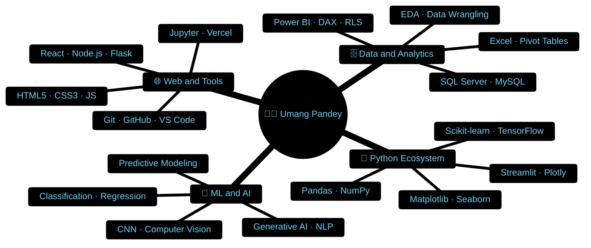
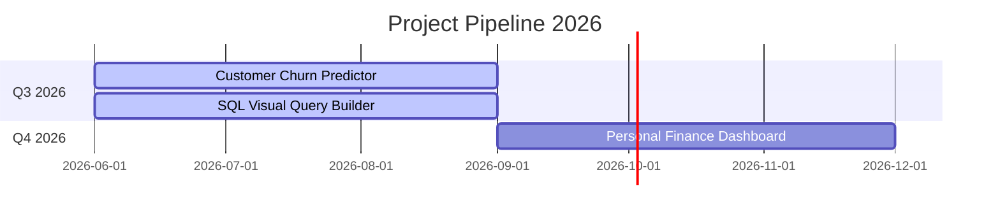
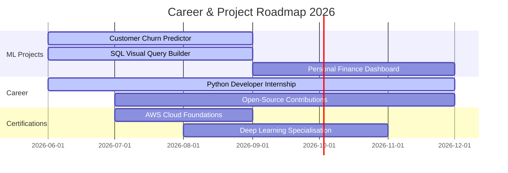

<div align="center">

<!-- ═══════════ ANIMATED WAVING HEADER (from Amritansh style) ═══════════ -->


<!-- ═══════════ TYPING ANIMATION ═══════════ -->
[](https://git.io/typing-svg)

<br/>

<!-- ═══════════ QUICK STATS BADGES (from Amritansh style) ═══════════ -->

&nbsp;

&nbsp;

&nbsp;


<br/><br/>

<!-- ═══════════ SOCIAL LINKS (from Amritansh style) ═══════════ -->
<a href="mailto:umangpandey.co@gmail.com">
  
</a>&nbsp;
<a href="https://linkedin.com/in/umang-pandey-01b486273">
  
</a>&nbsp;
<a href="https://github.com/Umangpandey75">
  
</a>&nbsp;
<a href="https://umangpandey.vercel.app">
  
</a>&nbsp;


</div>

---

## 🧑‍💻 Who Am I?


```python
class UmangPandey:
    name       = "Umang Pandey"
    alias      = "Umangpandey75"
    location   = "Ghaziabad, Uttar Pradesh, India 🇮🇳"
    education  = "B.Tech CSE — NITRA Technical Campus"
    contact    = "umangpandey.co@gmail.com"
    phone      = "+91 7518593228"

    current_focus = [
        "Python · Pandas · Scikit-learn · Streamlit",
        "Power BI dashboards with DAX & RLS",
        "Predictive ML models for real-world data",
        "SQL Server schema design & optimisation",
    ]

    total_projects  = 10
    commits         = "180+"
    lines_of_code   = "8k+"
    philosophy      = "Query the data. Build the insight. Ship the WOW ✨"
    open_to         = ["Internships", "Freelance", "Collaborations"]

    fun_facts = {
        "tabs_or_spaces" : "4 spaces. Always. 🫡",
        "debug_mode"     : "print() → Stack Overflow → ☕ coffee",
        "best_ideas"     : "Walking or right before sleep 💡",
        "typing_speed"   : "~60 WPM",
    }
```

> *"I query databases, design interactive dashboards, and build predictive ML models that actually solve problems."*

<br clear="right"/>

---

## 🧠 Skills Map



---

## 🚀 Projects

<div align="center">


&nbsp;

&nbsp;

&nbsp;


</div>

<table>
<tr>
<td width="50%" valign="top">

### ❤️ Heart-IQ — Cardiac Prediction System
[](https://heartiqsystem.streamlit.app/)
[](https://github.com/Umangpandey75/HeartIQ-4th-year-project)


End-to-end **cardiac risk prediction web app** — analyzes patient clinical profiles and outputs heart disease probability scores via a pre-trained ML model.

- 🔐 Role-based access with **SMTP/SSL OTP recovery**
- 🖨️ Print-ready **CSS media print** PDF reports
- 📊 Interactive **Plotly** risk-factor charts

`#machine-learning` `#streamlit` `#healthcare`

</td>
<td width="50%" valign="top">

### 🧠 MindMapr-AI
[](https://mindmetric001.vercel.app/)
[](https://github.com/Umangpandey75/MindMapr-AI)


AI-powered **mind-mapping and metric analysis** tool using Generative AI and NLP to transform raw thoughts into structured mental models.

`#generative-ai` `#nlp` `#productivity`

</td>
</tr>

<tr>
<td width="50%" valign="top">

### 📧 EmailSarthi
[](https://emailsarthi.vercel.app/)
[](https://github.com/Umangpandey75/EmailSarthi)


Smart **bulk email automation platform** — personalized batch emails via integrated Email API with live send-status tracking.

`#email-automation` `#javascript` `#productivity`

</td>
<td width="50%" valign="top">

### ⚧️ Genderify-AI


CNN-powered **gender classification model** served via Flask REST API with a responsive React frontend. Full end-to-end deep learning pipeline.

`#cnn` `#tensorflow` `#computer-vision` `#flask`

</td>
</tr>

<tr>
<td width="50%" valign="top">

### 🎙️ Voice to Story Generator


Records voice input and uses **Google Gemini SDK** to transform raw speech into creative, structured narratives. Full MERN stack.

`#gemini-sdk` `#mern` `#voice-ai` `#nlp`

</td>
<td width="50%" valign="top">

### 📊 Employee Performance Dashboard
[](https://github.com/Umangpandey75)


Multi-source Power BI dashboard reducing manual reporting by **10%**. Features complex DAX KPIs and **Dynamic Row-Level Security (RLS)**.

`#powerbi` `#sql` `#dax` `#rls`

</td>
</tr>

<tr>
<td width="50%" valign="top">

### 🔊 SpeechTrans — AI Hindi Dubber
[](https://github.com/Umangpandey75/SpeechTrans)


AI-powered **speech translation and dubbing** tool — converts English audio to Hindi with lip-sync timing alignment using Python AI libraries.

`#speech-ai` `#translation` `#dubbing`

</td>
<td width="50%" valign="top">

### 📄 Resume Builder
[](https://github.com/Umangpandey75/Resume-Builder)


Dynamic **CV builder** with live preview and **CSS media print** one-click PDF export. Clean, ATS-friendly output templates.

`#resume` `#html-css` `#css-print`

</td>
</tr>

<tr>
<td width="50%" valign="top">

### 🎤 Vocal-AI — Speech Transcriber
[](https://github.com/Umangpandey75/Vocal-AI)


Real-time **Speech-to-Text transcription** engine with NLP post-processing for punctuation correction and speaker-aware formatting.

`#speech-to-text` `#nlp` `#python`

</td>
<td width="50%" valign="top">

### 📈 HR Analytics Dashboard


Comprehensive **HR attrition and performance dashboard** — retention rates, departmental productivity KPIs, and trend analysis with drill-through pages.

`#hr-analytics` `#powerbi` `#attrition`

</td>
</tr>
</table>

<details>
<summary><b>🔭 In the Pipeline — Coming Soon</b></summary>
<br>



| Project | Stack | Progress | ETA |
|---------|-------|----------|-----|
| 🔁 Customer Churn Predictor | Python · Scikit-learn · Streamlit | `████░░░░░░` 20% | Q3 2026 |
| 🧩 SQL Visual Query Builder | React · Node.js · SQL | `██░░░░░░░░` 15% | Q3 2026 |
| 💰 Personal Finance Dashboard | Power BI · Python · DAX | `█░░░░░░░░░` 10% | Q4 2026 |

</details>

---

## 🛠️ Technical Stack

<details open>
<summary><b>🐍 Python & Data Science</b></summary>
<br>


</details>

<details>
<summary><b>🤖 Machine Learning & AI</b></summary>
<br>


**Techniques:** Classification · Regression · CNN · Predictive Modeling · NLP · EDA

</details>

<details>
<summary><b>🗄️ Databases & BI Analytics</b></summary>
<br>


**SQL Skills:** Querying · Schema Design · Joins · Stored Procedures · Data Manipulation · RLS

</details>

<details>
<summary><b>🌐 Web Development</b></summary>
<br>


</details>

<details>
<summary><b>🔧 Tools & Platforms</b></summary>
<br>


</details>

---

## 🎓 Education

| Degree | Institution | Period | Location |
|--------|------------|--------|----------|
| 🎓 **B.Tech — Computer Science & Engineering** | NITRA Technical Campus | 08/2022 – Present | Ghaziabad, UP |
| 📚 **Intermediate — Science Stream** | MPVM Ganga Gurukulam | 04/2020 – 03/2021 | Prayagraj, UP |

---

## 📜 Certifications

| 🏆 Certificate | 🏢 Issuer | 🔗 Platform | 📅 Year |
|---------------|----------|------------|--------|
| Data Science Job Simulation | British Airways | Forage | Feb 2026 |
| Introduction to Generative AI | Google | Coursera | Jan 2026 |
| Oracle Cloud Infrastructure AI Foundations | Oracle | Oracle | 2025 |
| Data Analytics Job Simulation | Deloitte Australia | Forage | Aug 2025 |
| Data Analytics Intern Simulation | TATA Group | Forage | Jul 2025 |
| Data Visualisation Trainee | TATA Group | Forage | Jul 2025 |
| Data Analytics Certification | Oracle | Oracle | 2024 |
| Microsoft Azure SQL | Microsoft | Coursera | 2024 |
| Web Development Frontend | Infosys | Springboard | 2023 |
| Crash Course on Python | Google | Coursera | 2023 |

---

## 📊 GitHub Stats

<div align="center">
<table>
<tr>
<td width="50%">

</td>
<td width="50%">

</td>
</tr>
<tr>
<td colspan="2">

</td>
</tr>
</table>


</div>

---

## 🗺️ 2026 Roadmap



---

## 🤝 Connect

<div align="center">

<a href="mailto:umangpandey.co@gmail.com">
  
</a>&nbsp;
<a href="https://linkedin.com/in/umang-pandey-01b486273">
  
</a>&nbsp;
<a href="https://github.com/Umangpandey75">
  
</a>&nbsp;
<a href="https://umangpandey.vercel.app">
  
</a>

</div>

---

<!-- ═══════════ FOOTER WAVE ═══════════ -->


<div align="center">

*"Query the data. Build the insight. Ship the WOW. ✨"*


</div>
